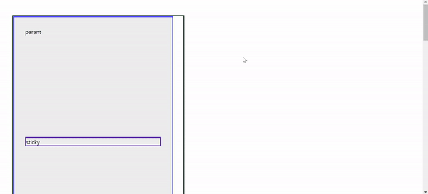
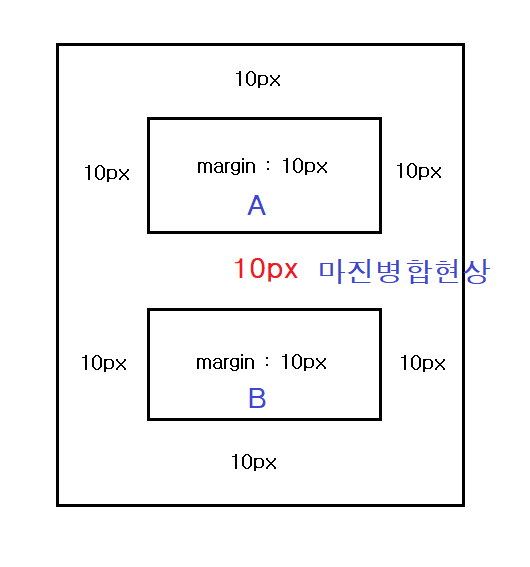

# BBC Clone

> [BBC Link](https://www.bbc.com/korean/resources/idt-48d3c9a7-4063-4289-9726-611b5ea9d7b5) 이 사이트를 클론 코딩해보자 🚀

> 최신 트렌드(🤩)인 `스크롤에 따른 인터렉티브함을 표현하는 것`을 학습해보자

> with [1분코딩](https://www.youtube.com/playlist?list=PLe9WXHRkq9p11MIiI1FnMc8aekiBShq2L)

# WIL(What I Learned this project)

> 이 프로젝트를 통해서 배운 내용을 간단하기 정리한다.

<br />

## CSS

### position : sticky

> 일반적으로 `position : static`과 유사하다. 하지만 스크롤이 설정한 값에 도달하면 `position : fixed`와 같은 효과를 나타낸다.

> `position : fixed`는 항상 뷰포트에 고정한다. 이와 비교하면, `position : sticky`는 부모태그의 절대위치가 스크롤 안에 들어있을 때 특정위치에 도달하면 `fixed` 효과를 갖게 된다. 만약 스크롤이 부모태그를 벗어나게 되면 `position : sticky`으로 설정된 엘리먼트는 `position : static`와 같은 효과를 낸다.



> 아래 코드의 프리뷰

```CSS
    .container {
        width: 500px;
        height: 500vh;
        border: 3px solid #123123;
        margin: 3rem;
    }
    .parent {
        width: 400px;
        height: 300vh;
        background-color: #eee;
        border: 3px solid #333fff;
        padding: 2rem;
    }
    .sticky {
        position: sticky;
        top: 0;
        left: 0;
        border: 3px solid #532aaa;
        margin: 300px 0;
    }
```

```HTML
    <div class="container">
        <div class="parent">
            parent
            <div class="sticky">sticky</div>
        </div>
    </div>
```

<br />

> `position : sticky`의 경우에는 <u>IE에서는 지원하지않기 때문에</u> IE에서 사용하기 위해선 `position:absolute` 를 사용하여 스크롤에 따라서 **자바스크립트로 구현**해줘야한다.

<br/>

### z-index 설정에 관한 몇가지 규칙

1. 아래와 같은 HTML구조로 만들어져 있을 때, `scroll-graphic` 태그에 position 속성을 주게 되면 그 다음의 `scroll-text`의 태그는 항상 그 밑으로 들어가게 된다. z-index를 주어도 상황은 변하지않는다. 현재 같은 쌓은 맥락이 아니기 때문이다. 이를 해결하기 위해선 같은 쌓임맥락으로 변경해줘야한다. `scroll-text` 태그에 position속성(relative)를 주면 된다.

   > 같은 쌓임맥락(stacking context)에서만 순서대로 쌓인다.

   ```HTML
   <div class="scroll-graphic">
       <!-- ... -->
   </div>
   <div class="scroll-text global-width">
       <!-- ... -->
   </div>
   ```

2. z-index를 설정하기 위해선 position속성(absolute, relative 등)이 설정되어 있어야 한다.

<br />

### 마진병합현상

> 마진병합현상이란 두 개의 엘리먼트 사이에 각각의 마진이 합쳐진 상태로 보여지는 현상을 말한다.

> 마진병합현상이 일어나는 조건

- 인접해 있는 block요소들끼리만 일어난다.
- 상하단의 마진에만 해당한다.



> 위 이미지를 보면, A의 bottom 마진, B의 top 마진이 각각 10px로 설정되어 `총 20px`이 되어야하지만 `10px`만 표현되었다. 이렇게 마진이 합쳐지는 현상이 `마진병합현상`이다.

> 이는 잘못된 것이 아니라 CSS설계상 내부적으로 의도된 것이다. 위의 상태를 보면 매우 안정적이라는 생각이 든다. 개발자에게 좀 더 편한 작업을 위한 내부적인 의도된 것임을 알 수 있다. <u>하지만 항상 마진병합현상이 이로울까?</u>

> 이 프로젝트에서 마진병합으로 생긴 문제의 코드

```HTML
    <div class="scroll-text">
        <div class="step">
            <!-- ... -->
        </div>
            <!-- div x 8 -->
        <div class="step">
            <!-- 마지막 div -->
        </div>
    </div>
```

```CSS
.scroll-text{
    /* 마진설정없음 */
}
.step{
    /* ... */
    margin-bottom: 60vh;
}
```

> 마진병합현상으로 인해 .step div의 margin-bottom이 .scroll-text 마진과 병합이 일어나서, 최종적으로 .scroll-text 의 margin-bottom에 60vh가 생성되었다. 그렇게 되면서 예상과는 다른 디자인이 나타나게 된다.

> **해결방법**

- 부모요소에서 공간을 차지하지만 영향이 없는 요소를 추가함으로서 부모와 자식 엘리먼트간 상하마진을 분리시킨다.
  - padding : 1px; (이 프로젝트에서의 해결법)
  - border : 1px solid transparent;
  - overflow : hidden;(부모요소에 설정)

<br/>

## JavaScript

### getBoundingClientRect()

`Element.getBoundingClientRect()`:

엘리먼트의 위치와 크기를 담은 객체를 리턴한다. 그 값은 뷰포트를 기준으로 상대적인 값을 갖는다.

```HTML
    <div class="wrapper">
        <div class="box box1">box1</div>
        <div class="box box2">box2</div>
        <div class="box box3">box3</div>
        <div class="box box4">box4</div>
        <div class="box box5">box5</div>
    </div>
```

```CSS
    .wrapper {
        width: 100%;
        height: 400vh;
        display: flex;
        flex-direction: column;
        justify-content: space-around;
        align-items: center;
        border: 1px solid black;
    }
    .box {
        width: 400px;
        height: 100px;
        text-align: center;
    }
    .box1 {
        background-color: aqua;
    }
    .box2 {
        background-color: aquamarine;
    }
    .box3 {
        background-color: blue;
    }
    .box4 {
        background-color: tomato;
    }
    .box5 {
        background-color: dodgerblue;
    }
```

```javascript
console.log(document.querySelector('.box1').getBoundingClientRect());
//페이지가 로딩되었을 때, wrapper 엘리먼트의 위치를 담은 객체를 출력한다.

const $box = document.querySelectorAll('.box');
window.addEventListener('scroll', (e) => {
	for (let i = 0; i < $box.length; i++) {
		console.log(i, $box[i].getBoundingClientRect());
		//스크롤이 일어날 때마다 박스1~5번의 위치를 담은 객체를 출력한다.
	}
});
```

```
bottom: 160.33333587646484
height: 100
left: 432.66668701171875
right: 832.6666870117188
top: 60.333335876464844
width: 400
x: 432.66668701171875
y: 60.333335876464844
```

> 출력된 결과값이 담고 있는 프로퍼티

> `bottom left right top`는 뷰포트를 기준으로 상대적인 엘리먼트의 위치를, `height width`는 가로, 세로 크기를 나타낸다. 또한 `x, y`는 엘리먼트의 좌측상단의 위치를 나타낸다.

> 스크롤에 따른 엘리먼트를 위치를 알기 위해선 `top`이나 `y`의 속성을 이용한다.

<br />

### Intersection Observer

> 특정 요소가 뷰포트에 포함되는지, 그렇지않은지, 쉽게 표현하자면, 현재 페이지에 보이는지 사라졌는지를 체크 할 수 있는 기능을 제공하는 API이다.

> 비동기적으로 작동한다.

> 여기서 사용한 이유 스크롤에 따라서 변화되는 요소만을 관찰하고 싶기 때문에. `Intersection Observer`를 사용하지않는다면, 기본적으로 스크롤이 일어날 때마다 변화에 상관없이 모든 요소를 관찰하게 된다. 여기서는 관찰요소가 몇 개 안되지만, 100개라고 한다면, 스크롤마다 100번씩 반복하게 되면 페이지 성능에 악영향을 미치게 될 수 있다. 이를 해결하기 위한 방법으로 `Intersection Observer`를 사용한 것이다. `Intersection Observer`를 사용하게 되면 화면에 보이는 요소만을 관찰하기때문에, 반복횟수가 2~3으로 줄게 된다.(말머리가 한 화면에 최대 2개만 나타나기때문에)

> > 페이지 성능 향상을 위해서 💥

```javascript
const io = new IntersectionObserver(callback [,option ] );
//생성자 함수를 통해서 인스턴스를 생성한다.

io.observe(element);
//관찰할 대상을 등록한다.

//관찰대상이 보이거나 사라지게 되면 콜백함수가 호출된다.
function callback(entries, observer){
    //entries는 관찰 대상에 대한 정보를 담고 있는 배열이다.
    entries.forEach(entry => {
        console.log(entry);
    })
}
```

> entry 객체가 담고 있는 프로퍼티들이다. 여기서는 `target`을 사용하였다. 그 외에 필요한 부분이 있을 때 찾아보면서 활용해야할 것 같다.

> [Link](https://heropy.blog/2019/10/27/intersection-observer/)

```javascript
boundingClientRect: DOMRectReadOnly {x: 432.65625, y: 47.25, width: 400.015625, height: 100.015625, top: 47.25, …}
//관찰대상(엘리먼트의 위치와 크기를 담고 있다)
intersectionRatio: 1
intersectionRect: DOMRectReadOnly {x: 432.65625, y: 47.25, width: 400.015625, height: 100.015625, top: 47.25, …}
isIntersecting: true
isVisible: false
rootBounds: DOMRectReadOnly {x: 0, y: 0, width: 1263.34375, height: 224, top: 0, …}
target: div.box.box1
//관찰대상의 엘리먼트 정보
time: 494.98999980278313
```

### 스크롤 이벤트 초기화

> 참고사항

```javascript
window.addEventListener('load', () => {
	setTimeout(() => {
		window.scrollTo(0, 0);
	}, 100);
});
```

> 스크롤에 따른 이미지 변화를 새로고침시 마다 초기화 해주기 위한 작업이다.

> 이것을 해주는 이유) Intersection Observer를 사용하여, 현재 보이는 화면을 기준으로 스크롤에 따른 화면 변화를 보여주는 상태인데, 새로고침이 제대로 갱신이 안된다. 이를 해결하기 위한 방법!

> `scrollTo()`가 바로 안먹는 경우가 있어서 `setTimeout`을 사용하여 해결할 수 있다. 이런 현상이 나타나는 이유는 크롬 브라우저가 너무 빨라서 scrollTo가 실행된 후에 현재 위치에 스크롤이 설정되기 때문이라고 한다.(결과적으로 스크롤의 위치가 갱신되지 않는 것!)
